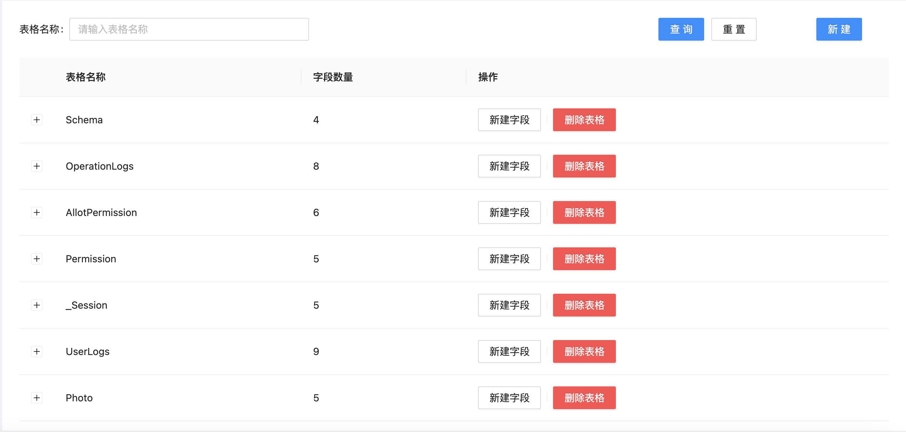
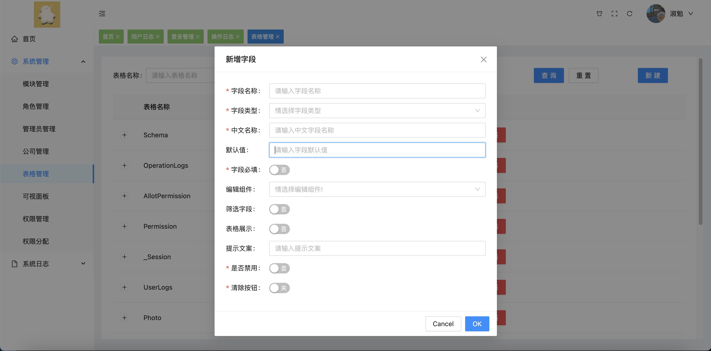
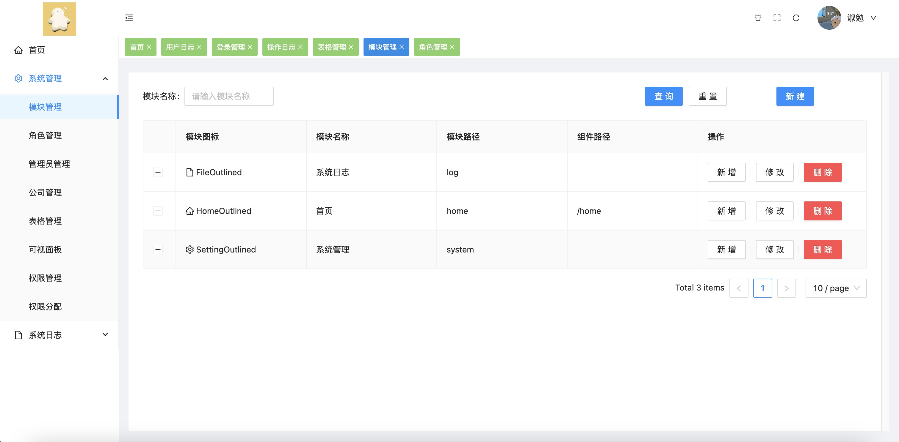
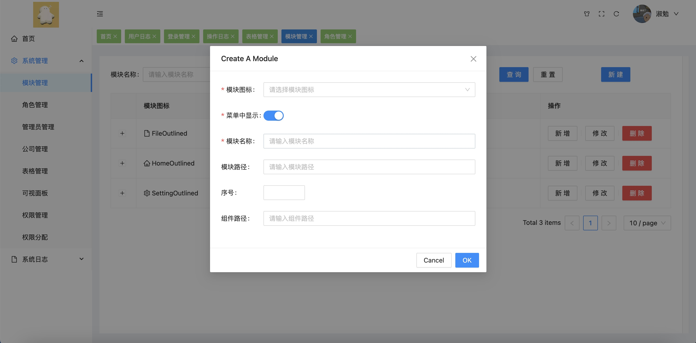
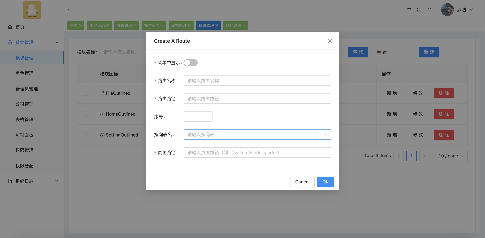
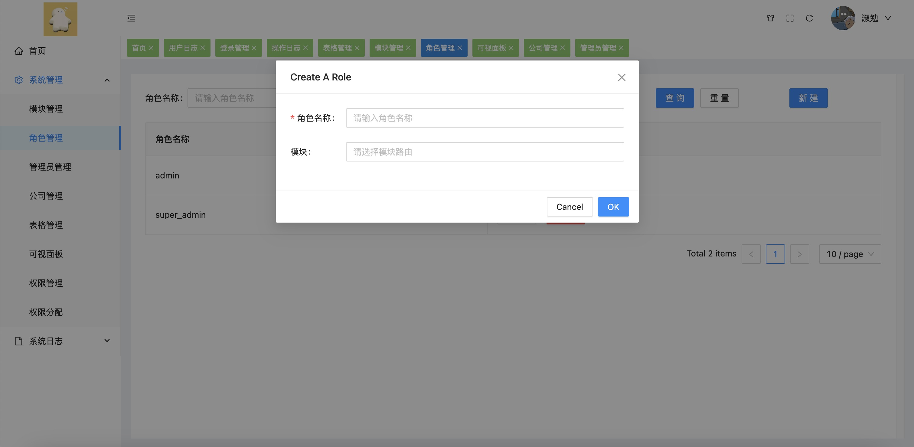
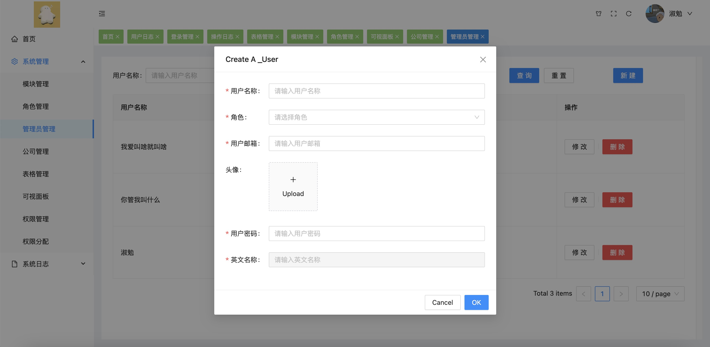
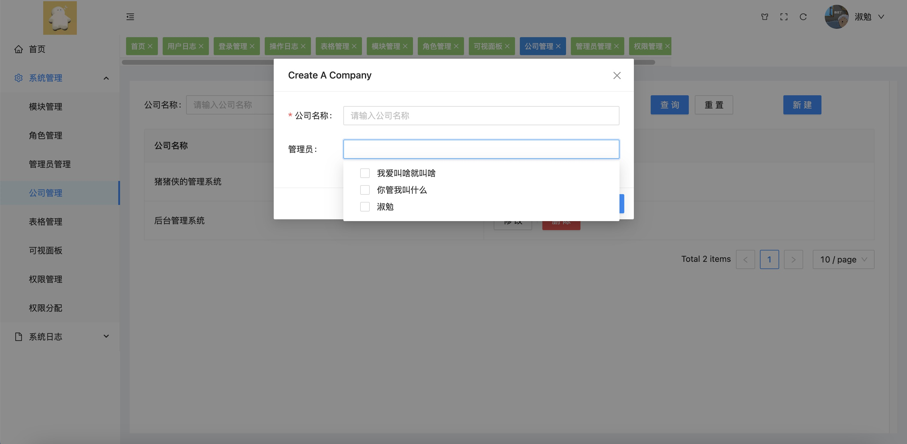

# 后台管理系统，一键生成单表增删查改，0代码搭建后台管理系统(不定期持续更新中)

# 前端采用Vue3 + Vuex + Vue-Router + Parse + Antd Design
# 后端采用Parse Server + Parse Dashboard + Express
# 数据库采用PostgreSQL

```
此系统可无需写代码搭建后台管理系统，例如宿舍管理系统、博客管理系统、旅游管理系统等等。
（1）可在线新建表格，无需再navicat连接数据库新建表格等繁琐操作
（2）实现不同用户页面级别、按钮级别的权限
（3）自定义修改字段所需要的组件（目前采用antd for vue）
（4）简化表格创建方式，前端开发也能面向全栈开发
（5）无需写单表前端代码或者后端代码，增删查改自动生成
（6）创建表格自动生成前台可使用的增删查改函数
需要完整数据库文件可站内私信
```


## 部分系统账号密码

### 综合后台管理系统（总后台系统）
```
账号：shumian，密码：123456
```

### 宿舍后台管理系统/公寓后台管理系统
```
账号：stuAdmin，密码：123456
```

### 博客后台管理系统
```
账号：blogAdmin，密码：123456
```


## 目前已开发以下功能
### 1、表格管理
```
表格管理已实现以下功能：
(1)、输入表格名称即可添加数据库表格，添加表格后会自动生成三个字段createdAt，updatedAt，objectId
(2)、可以在对应的表格下添加字段，并且可以设置字段名称，中文名称，字段的数据类型、字段的默认值、是否必填等信息
```

·表格管理


·添加字段


### 2、模块管理
```
模块管理已实现以下功能：
(1)、可以指定新增修改登录用户系统功能模块
(2)、可以在指定模块下新增页面，并且可以根据表格生成简单的增删查改页面无需再增加代码
(3)、可以自定义模块、路由在页面上展示的顺序
```
·模块管理


·新增模块


·新增模块下路由


### 3、角色管理
```
角色管理已实现以下功能：
(1)、新增角色
(2)、设置角色拥有权限的模块以及页面
```
·新增角色


### 4、管理员管理
```
管理员管理已实现以下功能：
(1)、新增可以登录系统的管理员
(2)、管理员账号继承角色拥有权限的模块、路由
```
·新增管理员账号


### 5、公司管理
```
公司管理已实现以下功能：
(1)、新增项目或者公司可以设置项目管理员，一个管理员账号只能管理一个项目或者公司
```
·新增公司


